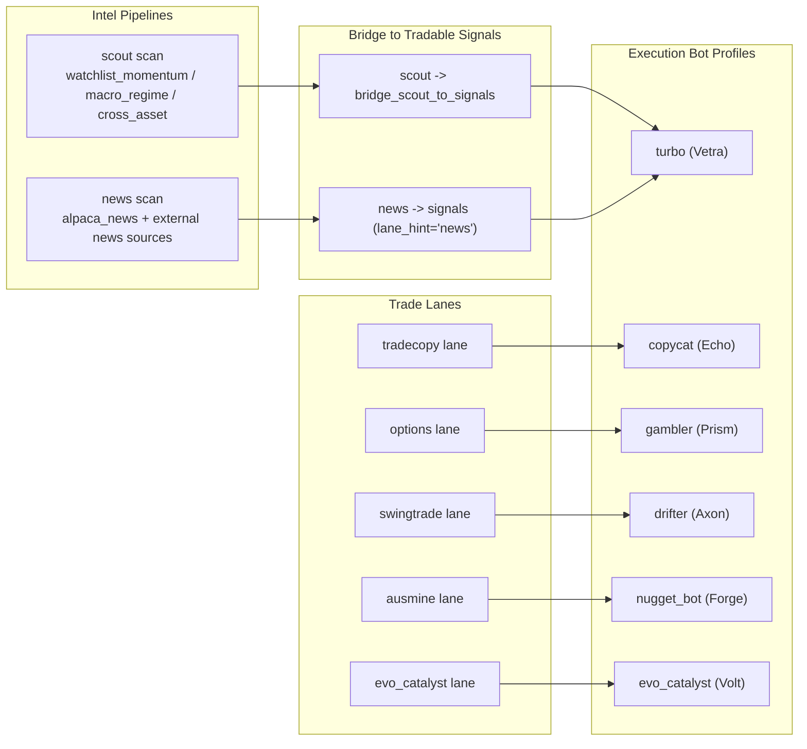

# Lane Intel -> Lane -> Bot Map

## 1) Overall Flow

## 2) How 5 Trade Lanes Work

### A. tradecopy -> copycat
- Input source:
  - Internal static `TRACKED_FUNDS` + holdings list.
- Main logic:
  - Build filing snapshot, aggregate holdings by symbol, compute consensus buy strength.
  - Filter by minimum support and notional thresholds.
- Entry trigger:
  - Create signals for top consensus candidates (`source="tradecopy"`).
- Notes:
  - Current implementation is synthetic/stub-like (not pulling live 13F directly in this lane service).

### B. options -> gambler
- Input source:
  - Pending signals in DB (`SignalsRepository.list_pending`), plus regime/equity/earnings checks.
- Main logic:
  - For each symbol in options universe, pick best pending signal for that symbol.
  - Evaluate call/put/skip based on signal action + score + regime.
  - Build option contract candidate and enforce allocation/position gates.
- Entry trigger:
  - Signal score must pass threshold and lane gates; then emit `source="options"` signals.

### C. swingtrade -> drifter
- Input source:
  - Pending signals in DB, broker quotes, regime, equity, earnings filter.
- Main logic:
  - Technical scoring per symbol (trend/RSI/ADX/volume/ATR/risk sizing).
  - Pending signal acts as a score booster (`_best_hawk_signal`).
  - Enforce sector and portfolio constraints.
- Entry trigger:
  - Candidate score above threshold + risk checks pass, then emit `source="swingtrade"` signals.

### D. ausmine -> nugget_bot
- Input source:
  - Recent `news.article` audit events + recent signals (excluding self), fallback headlines if too sparse.
- Main logic:
  - Parse headlines into tier/event keywords.
  - Match mining symbols, infer state/commodity sentiment, run tradeability checks.
  - Block duplicates and low-quality matches.
- Entry trigger:
  - Candidate passes tier/score/tradeability gating, then emit `source="ausmine"` signals.

### E. evo_catalyst -> evo_catalyst
- Input source:
  - Recent signals filtered by sources: `scout_*`, `alpaca_news`, `newsapi`, `gnews`, `ausmine`.
- Main logic:
  - Count support per watchlist symbol, score by support + deterministic base metric.
  - Rank candidates and keep top rows.
- Entry trigger:
  - Persist top catalyst candidates as `source="evo_catalyst"` signals.

## 3) Quick Mapping

- `tradecopy` -> `copycat`
- `options` -> `gambler`
- `swingtrade` -> `drifter`
- `ausmine` -> `nugget_bot`
- `evo_catalyst` -> `evo_catalyst`

